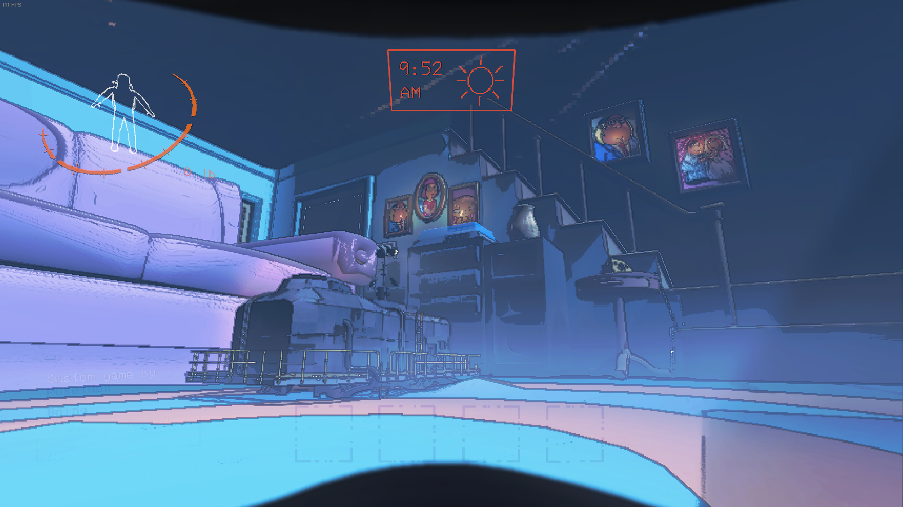

# About Luke Starr 2025

## About Me

Hi, I'm Luke Starr! I've had a deep interest in taking CSP and programming in general. I love solving problems and building project. Im eagar to learn more about programming and to learn more about software devlelopment. With other I have made multiple projects and creations. For example in Lethal Company a fairly popular steam game, my friends and I created one of the most popular modded maps in the world, with over 800,000 downloads. 
This project was exremley popular at its peak with celebrities with upwards of 11 million followers visting, and playing on the map.

Outside of my newer interest in programming, I enjoy playing some videogames with friends when I can. I'm passionate about starting game development.

